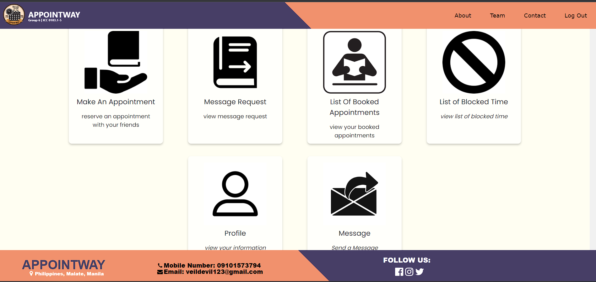

# GROUP-6---ICC-0103.1-5
## APPOINTWAY OF GROUP 6

### TABLE OF CONTENTS:
* [APPOINTWAY INTRODUCTION](#APPOINTWAY-INTRODUCTION)
* [INSTRUCTIONS](#INSTRUCTIONS)
* [ENDING REMARKS](#ENDING-REMARKS)

# APPOINTWAY INTRODUCTION

Welcome to Appointway, your reliable and efficient online appointment system designed to streamline the scheduling process and enhance your overall experience. With the ever-increasing demand for online services, Appointway provides a user-friendly platform that seamlessly connects service providers with their clients, ensuring a hassle-free and convenient appointment booking process.Gone are the days of tedious phone calls and endless back-and-forth emails to find a suitable time slot. Appointway offers a digital solution that empowers businesses and professionals to manage their appointments effortlessly, while enabling clients to book appointments at their convenience. With Appointway, service providers can create personalized profiles, showcasing their expertise, available services, and preferred scheduling options. Clients can easily browse through these profiles, view real-time availability, and select their preferred time slots with just a few clicks. 

 We all believe that time is precious, every tick of the clock means everything to everyone. Appointway is here to help you organize, manage, all of your appointments. May it be in work, school or something personal, Appointway is here with you, enjoy the effortless management of your time.

# INSTRUCTIONS
1. **Log In**, this is where you will put your account information ( if you don't have an account, please proceed to step 2)
   
    
2. **Sign Up**, this where you will register an account to continue on the website
   
    
3. The **Homepage**, this is where you will go after logging in your account. The homepage is where all the functionalities can be found.
   
    
4. The **About**, this is a webpage consist of some extra information about the website
   
    
5. The **Team**, is a webpage which is only about the people behind of this project
   
   
    
6. The **Contact**, this is where you can locate the customer contact information, whereyou will be contacting when you faced issues.
   
    
7. The **Make An Appointment**, this is where you will set the date and time and fill up the name of the person and the purpose of your appointment to him/her
   
    
8. The **Message Request**, this is where all the appointment will be receive and the user/you have a option on either accepting it or not, when decline, you will be transported to the **Reason** page where you will state your reason on declining.
   
   
    
9. The **List of Booked Appointments**, this is where you can find all the list of booked appointments in your account, this is where you can check which one is going first and so on.
    
10. The **List of Blocked Time**, this is where you can block a time when this showed time is not available for you and send a message consisting of your declining reasons
    
11. The **Your Profile**, this is where you can see and spectate your user account profile.
    
12. The **Message**, this is another way of contacting your friend, this is where you can include your message and the reason of sending messages.
    

# ENDING REMARKS

 Appointway is an all-inclusive and time-saving appointment management system we appreciate you checking out. It is your one-stop-shop for appointment administration and optimization, with features like appointment booking, message requests, a list of booked appointments, user profiles, blocked time management, and messaging capabilities. 

Appointway removes the bother of traditional appointment scheduling. Whether you're a professional with a packed schedule, a company with many clients, or a service provider, our platform can help you stay on top of everything. 

It was created out of the recognition that time is a scarce resource. Our straightforward layout, user-friendly controls, and robust features are here to streamline business processes and cut down on unnecessary paperwork. Focus on what you do best while Appointway takes care of the details of scheduling appointments. 

We're dedicated to making Appointway better and better so that it can keep up with your changing requirements. Don't be shy about letting us know what you think, making recommendations, or reporting problems you run into; we really value your input. 

We appreciate you considering Appointway as your go-to service for scheduling appointments. We can't wait to assist you with all of your scheduling needs. 

